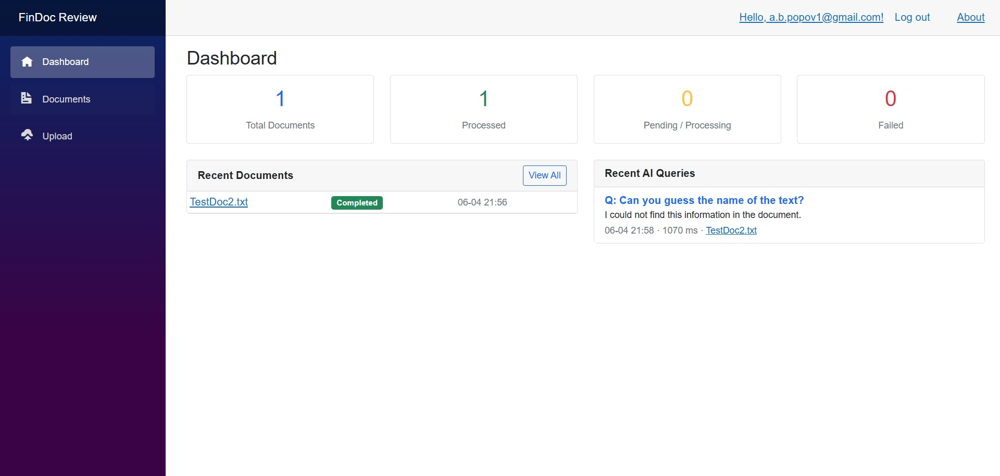
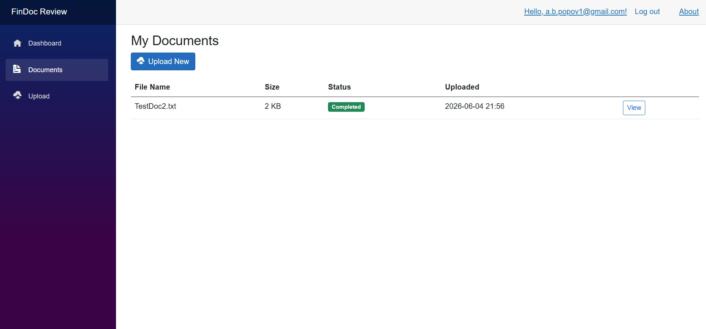
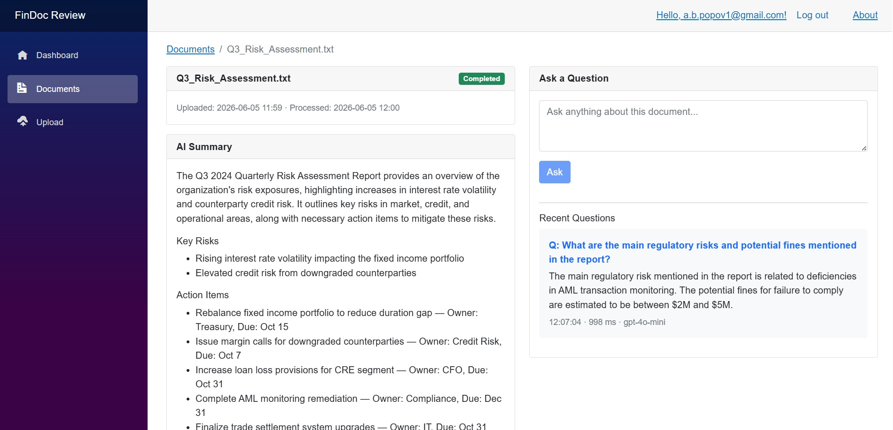

# AI Document Review Assistant

An enterprise-style ASP.NET Core application for uploading, analyzing, and querying financial documents using AI. Built to demonstrate modern .NET development practices with practical AI integration.




## Features

- **Document Upload** — PDF, DOCX, and TXT support with Azure Blob Storage
- **AI Summarization** — Automatic summary, key risks, and action items extraction
- **Q&A over Documents** — Ask questions in natural language, get answers with RAG
- **Semantic Search** — Cosine similarity search over document embeddings
- **Audit Logging** — Every AI query logged with latency, model, and source references
- **Dashboard** — Processing status, recent documents, recent AI queries



## Tech Stack

| Layer | Technology |
|-------|-----------|
| Frontend | Blazor Server |
| Backend | ASP.NET Core (.NET 10) |
| Database | SQL Server / Azure SQL + Entity Framework Core |
| AI Orchestration | Semantic Kernel |
| LLM | OpenAI gpt-4o-mini |
| Embeddings | text-embedding-3-small |
| Storage | Azure Blob Storage |
| Hosting | Azure App Service |
| CI/CD | GitHub Actions |

## Architecture
Blazor Server UI
│
ASP.NET Core Services
│
┌──────┼──────────────┐
│ │ │
Azure SQL Server OpenAI API
Blob (EF Core) (Semantic Kernel)

### RAG Pipeline
Upload → Extract Text → Chunk (500 tokens) → Embed (text-embedding-3-small)
│
Query → Embed Query → Cosine Similarity → Top-5 Chunks → gpt-4o-mini → Answer

## Architecture Decisions
**Blazor Server** — Chosen over Angular/React to keep the entire stack in C#. 
Appropriate for enterprise internal tools where SEO is not a concern.
**Semantic Kernel** — Microsoft's AI orchestration SDK. Provides model abstraction, 
prompt templating, and a natural migration path to Azure OpenAI.
**Embeddings in SQL Server** — Vectors stored as JSON arrays, cosine similarity 
computed in C#. Sufficient for document-scale workloads without the operational 
overhead of a dedicated vector database.
**IHostedService for processing** — Background document processing via .NET's 
built-in hosted service with a bounded channel queue. No external dependencies 
like Hangfire or RabbitMQ required for this scale.
## AI Cost Optimization
- Model: `gpt-4o-mini` ($0.15/$0.60 per 1M tokens) instead of GPT-4
- Embeddings: `text-embedding-3-small` ($0.02 per 1M tokens)
- Summarization uses only the first 3,000 characters of each document
- Summaries are generated once and cached in the database
- Estimated cost: **< $2 for typical portfolio usage**
## Enterprise Considerations
- **Audit trail** — All AI queries logged with user, document, model, latency, and token counts
- **Configuration management** — Secrets via ASP.NET User Secrets (dev) and Azure App Settings (prod)
- **No secrets in code** — API keys and connection strings never committed to repository
- **Background processing** — Document processing is async and non-blocking
- **Error handling** — Failed documents captured with error messages, visible in dashboard
## Getting Started
### Prerequisites
- .NET 10 SDK
- SQL Server (LocalDB or full)
- OpenAI API key
### Local Development
```bash
git clone https://github.com/your-username/FinDocReview.git
cd FinDocReview
dotnet user-secrets set "OpenAI:ApiKey" "your-key" --project src/FinDocReview.Web
dotnet ef database update --project src/FinDocReview.Infrastructure --startup-project src/FinDocReview.Web
dotnet run --project src/FinDocReview.Web
Configuration
{
  "ConnectionStrings": {
    "DefaultConnection": "your-sql-connection-string"
  },
  "OpenAI": {
    "ApiKey": ""
  },
  "Storage": {
    "Type": "Local",
    "LocalPath": "App_Data/uploads"
  }
}
Live Demo
https://findocreview-app.azurewebsites.net

Project Structure
src/
├── FinDocReview.Core/           # Domain entities, no dependencies
├── FinDocReview.Infrastructure/ # EF Core, AI services, storage
├── FinDocReview.Web/            # Blazor Server UI
└── FinDocReview.Tests/          # xUnit tests